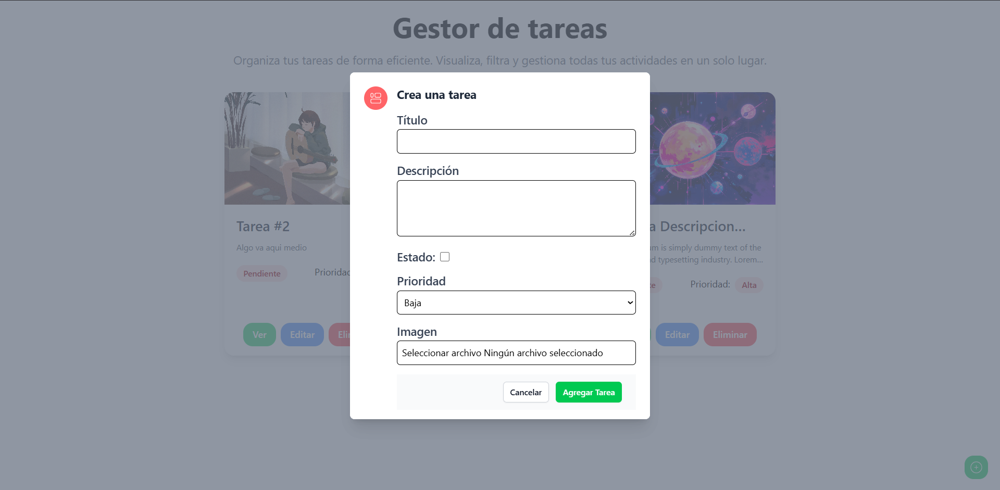

# FullStack TodoApp - Frontend

## 📝 Descripción

Esta es una aplicación de gestión de tareas (TodoApp) desarrollada con tecnologías modernas. Permite a los usuarios crear, editar, visualizar y eliminar tareas, además de poder asignarles prioridades, estados y adjuntar imágenes a cada tarea.

## 🚀 Tecnologías Utilizadas

- **React** - Biblioteca para construir interfaces de usuario
- **TypeScript** - Superset de JavaScript que añade tipado estático
- **Tailwind CSS** - Framework de CSS utilitario para diseño rápido y responsivo
- **Vite** - Herramienta de compilación que ofrece una experiencia de desarrollo más rápida
- **React Query** - Librería para gestión de estado y caché de datos del servidor
- **Axios** - Cliente HTTP para realizar peticiones al servidor
- **Headless UI** - Componentes de UI accesibles y sin estilos predefinidos
- **Notyf** - Biblioteca para mostrar notificaciones elegantes

## 🖼️ Capturas de Pantalla

### Vista Principal


### Modal de Creación/Edición


### Vista Detallada de Tarea


## ⚙️ Instalación

1. Clona el repositorio
```bash
git clone <url-del-repositorio>
```

2. Instala las dependencias
```bash
pnpm install
```

3. Crea un archivo .env con las variables de entorno necesarias
```env
VITE_API_URL=http://tu-backend-url
```

4. Inicia el servidor de desarrollo
```bash
pnpm run dev
```

## 🌟 Características

- ✅ Gestión completa de tareas (CRUD)
- 📊 Sistema de prioridades (Alta, Media, Baja)
- 🔄 Estado de tareas (Completado/Pendiente)
- 📸 Soporte para imágenes en las tareas
- 📱 Diseño responsivo
- 🎨 Interfaz moderna y amigable
- 🔔 Sistema de notificaciones

## 🛠️ Scripts Disponibles

- `pnpm run dev` - Inicia el servidor de desarrollo
- `pnpm run build` - Compila el proyecto para producción
- `pnpm run lint` - Ejecuta el linter para verificar el código
- `pnpm run preview` - Previsualiza la versión de producción localmente