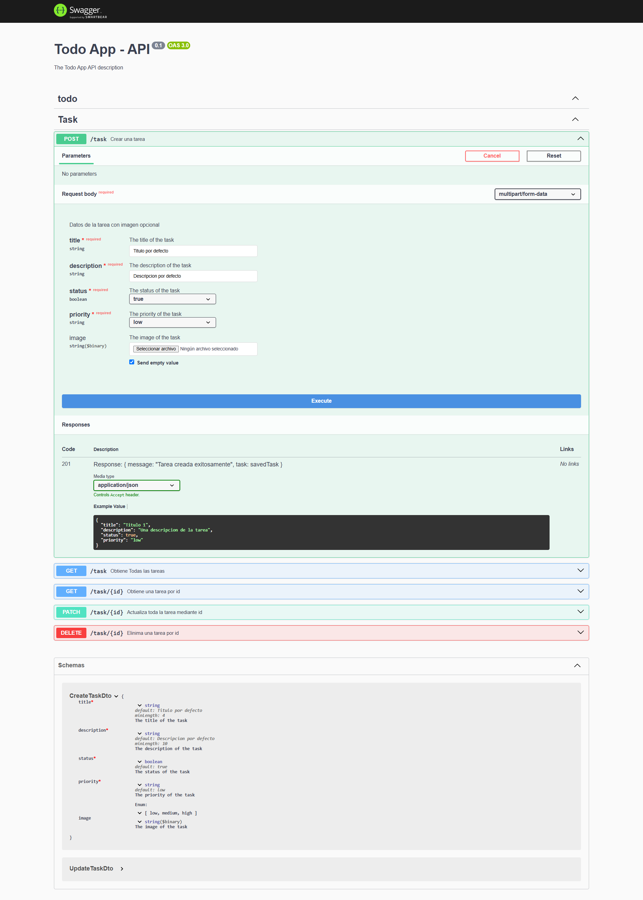

# Backend Todo App

## Descripción
Este es el backend de una aplicación de gestión de tareas (Todo App) construida con tecnologías modernas y robustas. Proporciona una API RESTful para manejar las operaciones CRUD de tareas y está diseñada con una arquitectura escalable.

## Tecnologías Principales

- **NestJS**: Framework de Node.js para construir aplicaciones del lado del servidor eficientes y escalables.
- **MongoDB**: Base de datos NoSQL utilizada para almacenar las tareas.
- **Mongoose**: ODM (Object Data Modeling) para MongoDB y Node.js.
- **Swagger/OpenAPI**: Documentación interactiva de la API.
- **Multer**: Middleware para el manejo de archivos en las peticiones.
- **CORS**: Habilitado para la comunicación segura con el frontend.
- **Validation Pipe**: Validación automática de datos entrantes.

## Documentación de la API

La documentación completa de la API está disponible en la ruta `/api` cuando el servidor está en ejecución. Aquí puedes explorar todos los endpoints disponibles y probarlos directamente desde la interfaz de Swagger.



## Configuración del Proyecto

### Requisitos Previos
- Node.js (versión 14 o superior)
- MongoDB instalado y en ejecución
- npm o yarn

### Variables de Entorno
Crea un archivo `.env` en la raíz del proyecto con las siguientes variables:

```env
PORT=3000
MONGODB_URI=tu_url_de_mongodb
ORIGIN_CLIENT=http://localhost:5173
```

### Instalación

1. Clona el repositorio
2. Instala las dependencias:
```bash
pnpm install
```

### Ejecución

Desarrollo:
```bash
pnpm run start:dev
```

Producción:
```bash
pnpm run build
pnpm run start:prod
```

## Características Principales

- Arquitectura modular con NestJS
- Integración con MongoDB usando Mongoose
- Documentación interactiva con Swagger
- Validación de datos con class-validator
- Manejo de archivos con Multer
- CORS configurado para desarrollo
- Configuración de variables de entorno