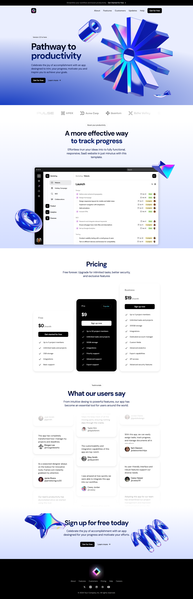

# Landing Page SaaS



Una moderna landing page para SaaS construida con las últimas tecnologías web. Diseñada para ofrecer una experiencia de usuario fluida y atractiva, con animaciones suaves y un diseño responsivo.

## Tecnologías Utilizadas

- **Next.js 14** - Framework de React para producción
- **React 18** - Biblioteca para interfaces de usuario
- **TailwindCSS** - Framework de CSS utilitario
- **Framer Motion** - Biblioteca de animaciones para React

## Características

- ⚡ Rendimiento optimizado con Next.js
- 🎨 Diseño moderno y responsivo
- 🌈 Animaciones fluidas con Framer Motion
- 📱 Totalmente adaptable a dispositivos móviles
- 🛠 Construido con TypeScript para mayor robustez

## Instalación

```bash
# Clonar el repositorio
git clone [https://github.com/JuanferGG/nextJs-nestJs.git]

# Instalar dependencias
npm install

# Iniciar servidor de desarrollo
npm run dev
```

## Scripts Disponibles

- `npm run dev` - Inicia el servidor de desarrollo
- `npm run build` - Construye la aplicación para producción
- `npm start` - Inicia la aplicación en modo producción
- `npm run lint` - Ejecuta el linter

## Estructura del Proyecto

```
src/
  ├── app/          # Configuración y páginas de Next.js
  ├── assets/       # Imágenes y recursos estáticos
  ├── components/   # Componentes reutilizables
  └── sections/     # Secciones principales de la landing page
```
