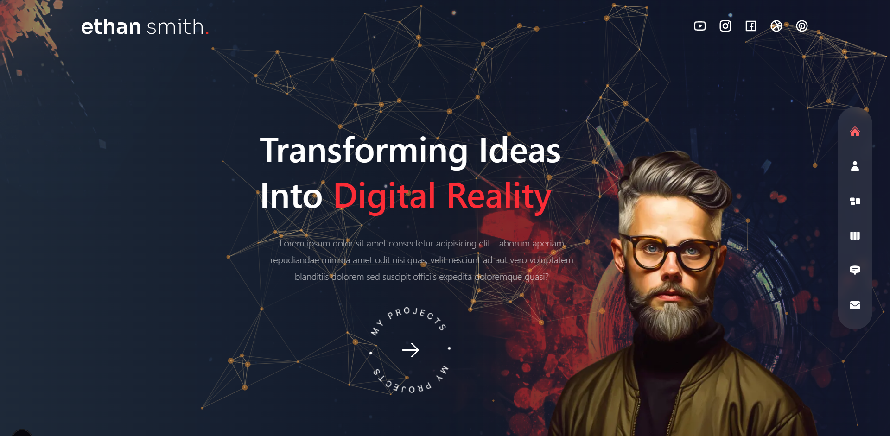
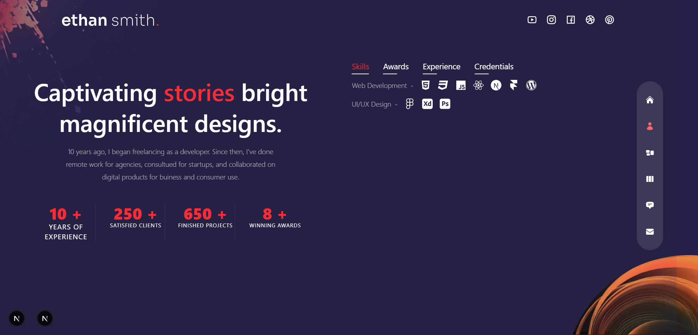
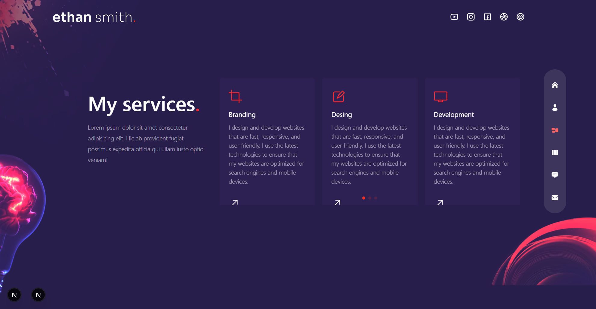
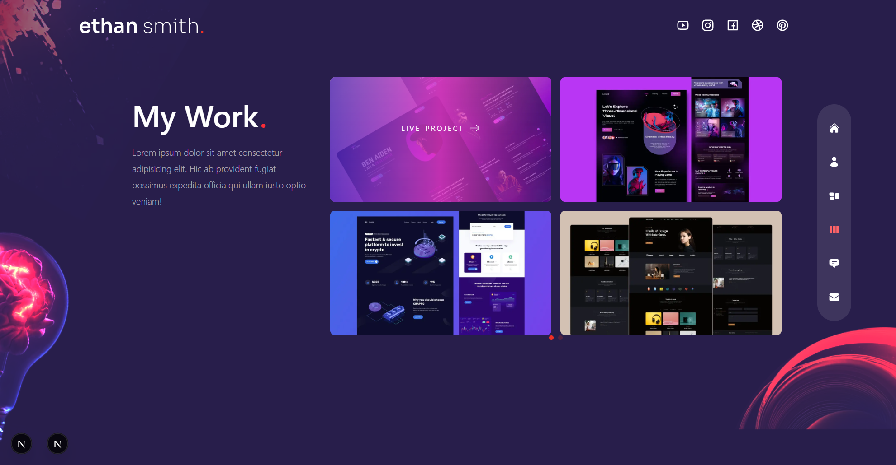
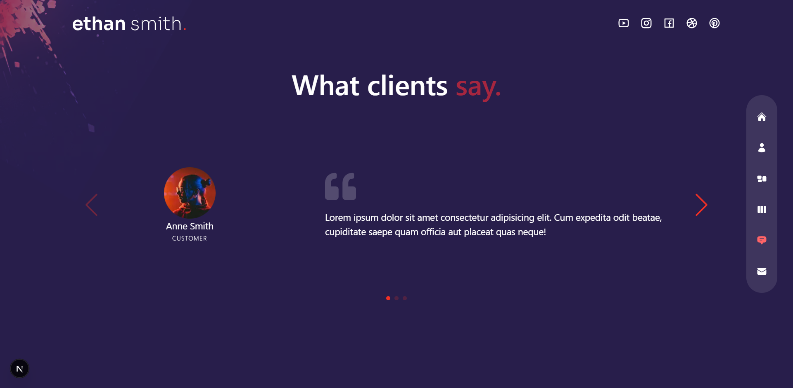
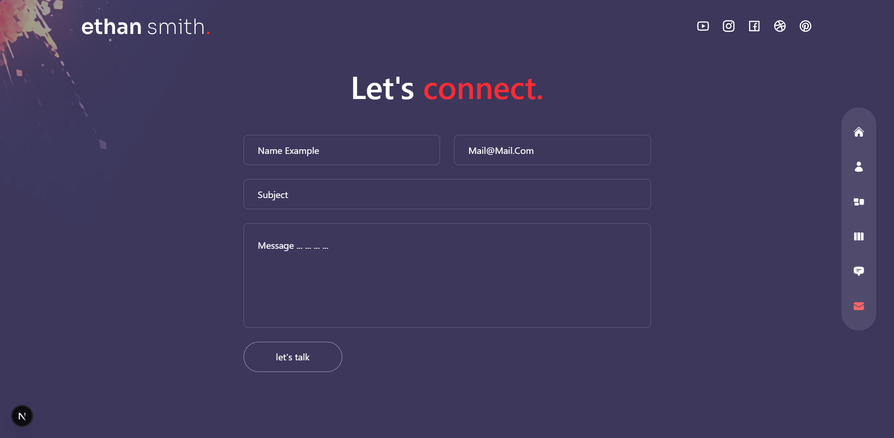

# Portafolio Multipágina con Next.js y Tailwind CSS

Este es un proyecto de portafolio personal construido con Next.js, React, Tailwind CSS y Framer Motion. Muestra diferentes secciones como "Acerca de mí", "Servicios" y "Trabajos".

## Tecnologías Utilizadas

*   **Framework Frontend:** [Next.js](https://nextjs.org/)
*   **Librería UI:** [React](https://reactjs.org/)
*   **Estilos:** [Tailwind CSS](https://tailwindcss.com/)
*   **Animaciones:** [Framer Motion](https://www.framer.com/motion/)
*   **Slider/Carrusel:** [Swiper](https://swiperjs.com/)
*   **Partículas:** [React TSParticles](https://github.com/matteobruni/tsparticles) / [tsparticles](https://github.com/matteobruni/tsparticles)
*   **Iconos:** [React Icons](https://react-icons.github.io/react-icons/)
*   **Contador:** [React CountUp](https://github.com/glennreyes/react-countup)
*   **Lenguaje:** [TypeScript](https://www.typescriptlang.org/)

## Vistas Previas del Proyecto








## Cómo Empezar

1.  Clona el repositorio:
    ```bash
    git clone https://github.com/JuanferGG/nextJs-nestJs.git
    cd multipage-portfolio
    ```
2.  Instala las dependencias:
    ```bash
    npm install
    # o
    yarn install
    ```
3.  Inicia el servidor de desarrollo:
    ```bash
    npm run dev
    # o
    yarn dev
    ```

Abre [http://localhost:3000](http://localhost:3000) en tu navegador para ver el proyecto.